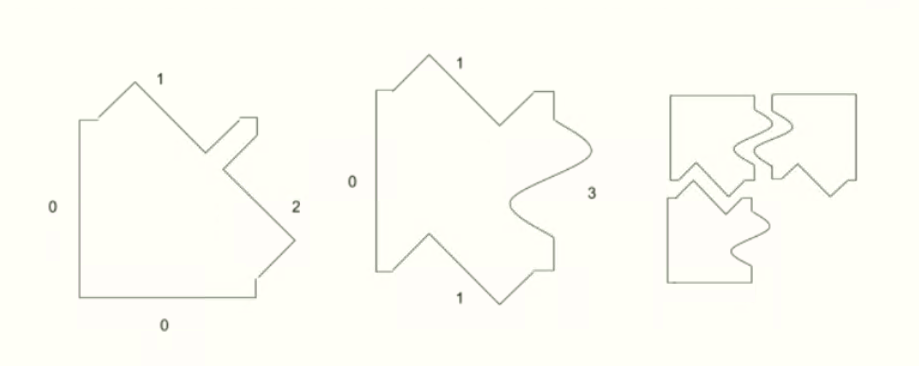

# java-guess-the-image-puzzle
This is the use case of this puzzle.
## brief description:

All the pieces of our puzzle have four sides. Each one of the sides is represented by a positive
integer. These numbers represent shapes. The number zero represents the border, which is a special
side. For example, on these pieces, you can see sides 0 (border), 1, 2 and 3. Side 1 fits with side 1,
side 2 would fit with side 2, etc. On the last images you can see how 3 pieces could fit together

# result
